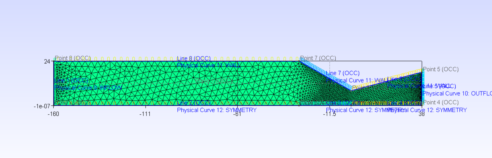
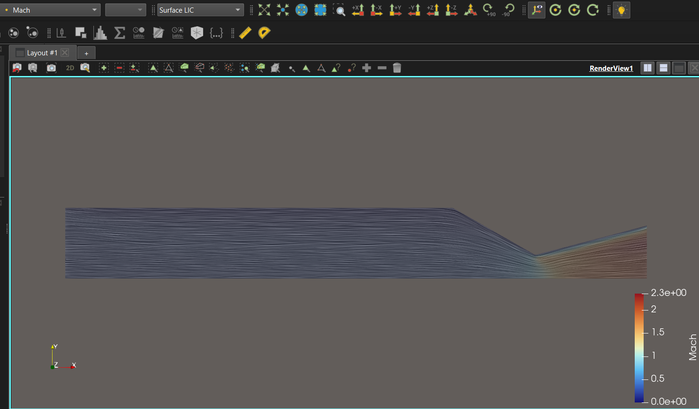
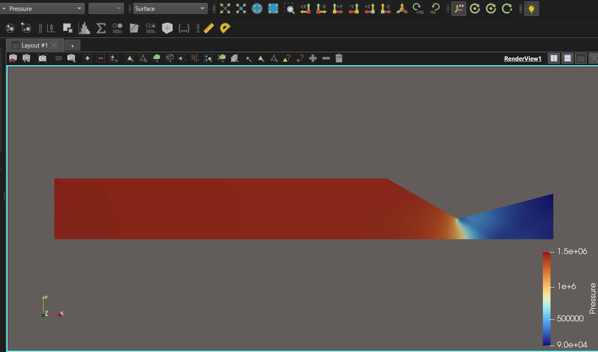
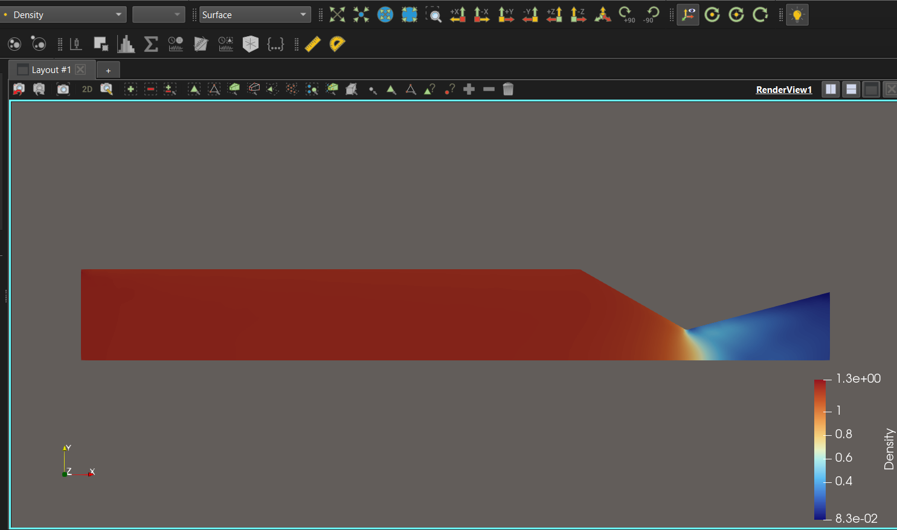
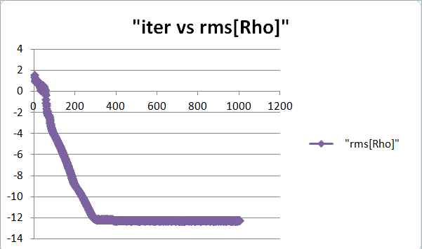

# 🚀 Supersonic Rocket Nozzle Simulation using SU2

<div align="center">


<br/>

```
 ════════════════════════►►►  M > 1
 [CHAMBER] ══► [THROAT] ══════════► [EXIT]
              (M = 1.0)         (SUPERSONIC)
```

> **Compressible turbulent flow in a converging–diverging rocket nozzle** simulated from scratch using the **SU2 CFD solver**.  
> Models the expansion of high-temperature combustion gases through a De Laval nozzle generating approximately **600 N thrust**.

</div>

---

## 📖 About This Project

This repository contains the configuration and setup for simulating **compressible turbulent flow** in a converging–diverging rocket nozzle using the **SU2 CFD solver**.

The objective of this assignment was to **develop the nozzle simulation from scratch using SU2**, understand the solver configuration, and explore the numerical modeling of compressible turbulent flow.

---

## 👨‍💻 Author

<div align="center">

### **Boddu Harshavardhan**
*Mechanical Engineering — GVP College of Engineering, India*

[](https://github.com/harshaverse)

</div>

---

## 🌀 Project Overview

Rocket engines accelerate high-pressure combustion gases through a **converging–diverging (De Laval) nozzle**. The flow physics involve:

```
  SUBSONIC            SONIC            SUPERSONIC
  ──────────        ────────          ────────────
  Converging   →    Throat (M=1)  →   Diverging
   Section           Choked            Section
```

| 📍 Section        | 🌀 Flow Regime   | 💡 Description                         |
|------------------|----------------|----------------------------------------|
| Converging       | Subsonic        | Flow accelerates toward throat         |
| Throat           | Sonic (M = 1)   | Flow choked, maximum mass flow rate    |
| Diverging        | Supersonic      | Further acceleration, pressure drops   |

This simulation captures these phenomena using the **Reynolds-Averaged Navier–Stokes (RANS)** equations.

---

## 🌪️ Turbulence Model

The simulation uses the **Shear Stress Transport (SST) k–ω turbulence model**.

**Advantages of SST:**

- ✅ Accurate near-wall behavior
- ✅ Good prediction of adverse pressure gradients
- ✅ Suitable for high-speed aerodynamic flows

```cfg
SOLVER            = RANS
KIND_TURB_MODEL   = SST
```

---

## 🧪 Gas Model

The working fluid is modeled as an **ideal gas** representing hot combustion gases.

| 🔬 Property            | 📋 Value        |
|-----------------------|----------------|
| **Gamma (γ)**         | 1.22           |
| **Gas Constant**      | 377 J/kg·K     |
| **Chamber Pressure**  | 1.5 MPa        |
| **Chamber Temperature** | 3200 K       |

---

## 🔧 Boundary Conditions

<table>
<tr>
<th>📍 Boundary</th>
<th>⚙️ Type</th>
<th>📋 Value</th>
</tr>
<tr>
<td>🔴 <b>Inlet</b> (Chamber)</td>
<td>Total pressure & temperature</td>
<td><code>1,500,000 Pa | 3200 K</code></td>
</tr>
<tr>
<td>🟢 <b>Outlet</b></td>
<td>Static pressure (atmospheric)</td>
<td><code>101,325 Pa</code></td>
</tr>
<tr>
<td>⚫ <b>Walls</b></td>
<td>Adiabatic no-slip</td>
<td><code>MARKER_HEATFLUX = (WALL, 0.0)</code></td>
</tr>
<tr>
<td>🔵 <b>Symmetry</b></td>
<td>Axisymmetric assumption</td>
<td><code>MARKER_SYM = (SYMMETRY)</code></td>
</tr>
</table>

---
```cfg
CFL_NUMBER = 10
CFL_ADAPT  = YES
```

---

## 🕸️ Mesh

The simulation uses a structured nozzle mesh:

```
nozzlemesh600.su2
```

> The mesh represents the **converging**, **throat**, and **diverging** sections of the rocket nozzle.



---

## ▶️ Running the Simulation

**Single core:**
```bash
mpirun -np 1 SU2_CFD config.cfg
```

**⚡ Parallel (recommended):**
```bash
mpirun -np 4 SU2_CFD config.cfg
```

---

## 📤 Simulation Outputs

| 📄 File               | 📋 Description           |
|----------------------|--------------------------|
| `history.csv`        | Convergence history       |
| `flow.vtu`           | Flow field solution       |
| `restart_flow.dat`   | Restart file              |
| `surface_flow.csv`   | Surface flow quantities   |

> All files can be visualized in **ParaView**.

---

## 🖼️ Results & Visualization

Flow results visualized using **ParaView**:

| 📊 Plot | 🖼️ Preview |
|--------|-----------|
| 🔵 **Mach Number Distribution** |  |
| 🔴 **Pressure Contours** |  |
| 🟠 **Temperature Field** | .png) |
| 🟣 **Density Variation** |  |
| 📈 **Convergence History** |  |

---

## 🗂️ Repository Structure

```
Assignment-2-From-Scratch-Development-of-a-Supersonic-Nozzle
│
├── 📄 600n_config.cfg              ← SU2 solver configuration
├── 📄 nozzlemesh600.su2            ← Structured nozzle mesh
├── 📄 history.csv                  ← Convergence history
├── 📄 flow.vtu                     ← Flow field (ParaView)
├── 📄 surface_flow.vtu             ← Surface solution
├── 📄 restart_flow.dat             ← Restart file
├── 🖼️  Mach.png                    ← Mach number contour
├── 🖼️  Pressure.png                ← Pressure contour
├── 🖼️  Temperature (2).png         ← Temperature contour
├── 🖼️  Density.png                 ← Density contour
├── 🖼️  MESH.png                    ← Mesh visualization
├── 🖼️  graph01.png                 ← Convergence plot
└── 📄 README.md
```

---

## 🎓 Learning Outcomes

Through this project the following concepts were explored:

| 🧠 Concept                          | 📚 Description                             |
|------------------------------------|-------------------------------------------|
| 💨 Compressible CFD                 | High-speed flow simulation techniques     |
| 🚀 Rocket Nozzle Flow Physics       | De Laval nozzle theory & choked flow      |
| 🌪️ RANS Turbulence Modeling         | SST k–ω model configuration               |
| 🔧 SU2 Solver Configuration         | From-scratch case setup                   |
| 🔢 Numerical Schemes                | ROE, FGMRES, Green–Gauss gradient         |
| 📊 Post-Processing                  | ParaView visualization of flow fields     |

---

## 📚 References

| 📖 Resource               | 🔗 Link                                       |
|--------------------------|-----------------------------------------------|
| **SU2 Official Repo**    | [github.com/su2code/SU2](https://github.com/su2code/SU2) |
| **SU2 Documentation**    | [su2code.github.io](https://su2code.github.io) |
| **Anderson, J. D.**      | *Modern Compressible Flow with Historical Perspective* |

---

<div align="center">

🔥 **From subsonic chamber to supersonic exit — all in one simulation.**

<sub>Built with ❤️ using SU2 CFD | Supersonic Rocket Nozzle — 600 N Thrust Simulation</sub>

</div>
